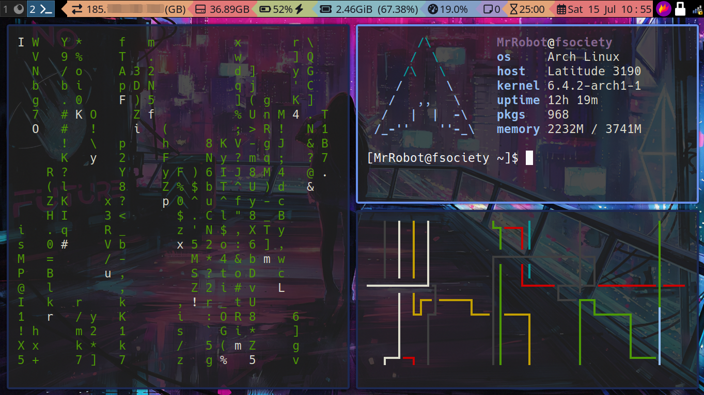

# Dot files



## What's unique

### Compartmentalisation

Personally I believe the i3 config file is extremely messy and hard to maintain. Consequently I have compartmentalised it into several configuration files that a Python script strings together. Note that this Python script runs everytime i3 is reloaded using  ```$mod+Shift+r```. Furthermore ANYTHING in the *configs* directory will end up in the i3 configs file - therefore it's imperative **only** config files go in there. Additionally it is advisable to have a new line at the end of each config file to keep the actual i3 config file neat (although you'll probably never look at it again so it doesn't really matter).

### Bookmark system

In ```configs/keybindings``` you'll find the following lines:

```shell
# Run dmenu for bookmarks (open in default browser)
bindsym $mod+b exec xdg-open $(grep -v '^#' $HOME/.config/i3/bm.txt | dmenu -i -nb '#191919' -nf '#fea63c' -sb '#fea63c' -sf '#191919' -fn 'NotoMonoRegular:bold:pixelsize=22.5' | cut -d' ' -f1)
bindsym $alt+b exec xdotool type $(grep -v '^#' $HOME/.config/i3/bm.txt | dmenu -i -nb '#191919' -nf '#fea63c' -sb '#fea63c' -sf '#191919' -fn 'NotoMonoRegular:bold:pixelsize=22.5' | cut -d' ' -f1)

# Run dmenu to add bookmark
bindsym $mod+Shift+b exec echo -n | dmenu -i -nb '#191919' -nf '#fea63c' -sb '#fea63c' -sf '#191919' -fn 'NotoMonoRegular:bold:pixelsize=22.5' -p "URL: " >> $HOME/.config/i3/bm.txt
bindsym $alt+Shift+b exec echo -n | dmenu -i -nb '#191919' -nf '#fea63c' -sb '#fea63c' -sf '#191919' -fn 'NotoMonoRegular:bold:pixelsize=22.5' -p "URL: " >> $HOME/.config/i3/bm.txt
```

```$mod+b``` allows bookmarks to be searched using dmenu and the search to open in the default browser. Alternatively ```$alt+b``` will use *xdotool type* to type it out; useful if you have a search bar selected (usually ```ctrl+l``` in most browsers. Note that you can also add bookmarks too; experiment as you like!

### Fake webcam in scripts

This will require some basic linux knowledge (or research) to setup by essentially allows you to stream video files to your webcam.

### Random Mac address

Go to `/etc/NetworkManager/conf.d/00-macrandomize.conf ` and add the following:

```
[device]
wifi.scan-rand-mac-address=yes

[connection]
wifi.cloned-mac-address=stable
ethernet.cloned-mac-address=stable
connection.stable-id=${CONNECTION}/${BOOT}
```
Note that `wifi.cloned-mac-address=` **stable** will create a random virtual mac address per connection (access point it connects to). If you want it completely random then change this from **stable** to **random**.

Afterwards you need to restart NetworkManager for the effects to take place using `doas systemctl restart NetworkManager`

### Knit

Essentially this command allows me to render RMarkdown files easily. To install run the following:

```shell
# Because it's a personal script
sudo cp knit /usr/local/bin/
```

### Doas

I don't like to use sudo as it has had several vulnerabilities in the past such as buffer-overflow and more. Doas is the superior option. Install it and run the following as root:  `echo "permit persist :wheel" > /etc/doas.conf

### USBguard

Install usbguard and then enable it with  `doas systemctl enable usbguard --now`

To find blocked usb devices run: `doas usbguard list-devices --tree -b`

To allow a usb-device to work (until unplugged) run: `doas usbguard allow-device <device number>`

To allow a usb-device to work **permanently** run: `doas usbguard allow-device <device number> -p`

Additionally you can block devices using "block" instead of "allow"

# Shell settings
Just run the following:

```shell
doas pacman -Syyu zsh && sh -c "$(wget https://raw.github.com/ohmyzsh/ohmyzsh/master/tools/install.sh -O -)" && git clone https://github.com/zsh-users/zsh-autosuggestions ${ZSH_CUSTOM:-~/.oh-my-zsh/custom}/plugins/zsh-autosuggestions && git clone https://github.com/zsh-users/zsh-syntax-highlighting.git ${ZSH_CUSTOM:-~/.oh-my-zsh/custom}/plugins/zsh-syntax-highlighting
```

Then run ```chsh``` and enter ```/bin/zsh``` when prompted.

Next cp over the .zshrc file from here to your home directory and BOOM!

# Another note

### Bumblebee status bar

Make sure to ```cd``` into *$HOME/.config/i3* and run ```git clone https://github.com/tobi-wan-kenobi/bumblebee-status.git```

You'll also need to install the required dependancies for the modules you're using: [Find docs here](https://bumblebee-status.readthedocs.io/en/main/modules.html)

Without modifications you'll need the following pip modules: `psutil` (for cpu) and `netifaces` (for publicip)

### VSCode

Also might be a good idea to copy over the vscodeconfig file to VScode as well as installing the font VictorMono (which is amazing!)

### Touchpad (tap to click)

With the i3 config, touchpad where you're able to tap the touchpad to click may not work. Here's why and how to fix it:

The following line enables feature:  `exec_always xinput set-prop "MSFT0001:00 04F3:3082 Touchpad" "libinput Tapping Enabled" 1` and work for my **specific** touchpad. Note yours might need to be changed. To find yours run `xinput`

### Setting everything to dark mode

`echo "gtk-application-prefer-dark-theme=1" >> $HOME/.config/gtk-3.0/settings.ini`

# There's a few dependancies but you'll work them out ;)

Here are a few that I remember and I'll keep adding to it

```doas pacman -Syyu xdotool imagemagick scrot network-manager-applet flameshot alsa-utils ttf-nerd-fonts-symbols noto-fonts noto-fonts-emoji ttf-hack veracrypt python-pip python-requests python-bs4 thunar thunar-volman thunar-archive-plugin zip unzip neovim picom i3-gaps xorg dmenu exfat-utils usbguard feh xorg-xinit sddm xclip htop net-tools networkmanager android-tools qbittorrent```

You'll need to install yay then...

`yay logseq lesspass`
