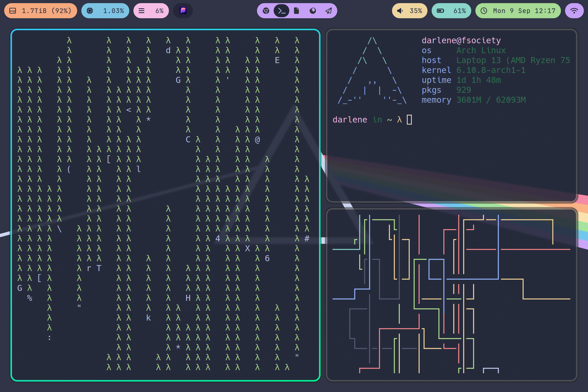

# Dot files



Hyprland config lives in `~/.config/hypr/hyprland.conf`

### Random Mac address

Go to `/etc/NetworkManager/conf.d/00-macrandomize.conf ` and add the following:

```
[device]
wifi.scan-rand-mac-address=yes

[connection]
wifi.cloned-mac-address=stable
ethernet.cloned-mac-address=stable
connection.stable-id=${CONNECTION}/${BOOT}
```
Note that `wifi.cloned-mac-address=` **stable** will create a random virtual mac address per connection (access point it connects to). If you want it completely random then change this from **stable** to **random**.

Afterwards you need to restart NetworkManager for the effects to take place using `doas systemctl restart NetworkManager`

### Doas

I don't like to use sudo as it has had several vulnerabilities in the past such as buffer-overflow and more. Doas is the superior option. Install it and run the following as root:  `echo "permit persist :wheel" > /etc/doas.conf`

### USBguard

Basically stops rubber ducky attacks and any unauthorised USB device accessing the system

Install usbguard and then enable it with  `doas systemctl enable usbguard --now`

To find blocked usb devices run: `doas usbguard list-devices --tree -b`

To allow a usb-device to work (until unplugged) run: `doas usbguard allow-device <device number>`

To allow a usb-device to work **permanently** run: `doas usbguard allow-device <device number> -p`

Additionally you can block devices using "block" instead of "allow"

### Shell settings
Just run the following:

```shell
doas pacman -Syyu zsh && sh -c "$(wget https://raw.github.com/ohmyzsh/ohmyzsh/master/tools/install.sh -O -)" && git clone https://github.com/zsh-users/zsh-autosuggestions ${ZSH_CUSTOM:-~/.oh-my-zsh/custom}/plugins/zsh-autosuggestions && git clone https://github.com/zsh-users/zsh-syntax-highlighting.git ${ZSH_CUSTOM:-~/.oh-my-zsh/custom}/plugins/zsh-syntax-highlighting
```

Next cp over the .zshrc file from here to your home directory and BOOM!

### VSCode

Also might be a good idea to copy over the vscodeconfig file to VScode as well as installing the font [Victor Mono]https://rubjo.github.io/victor-mono/). To do this download the font from the link provided, extract the files and copy the contents of TTF/* to `/usr/share/fonts/TTF`

### Setting everything to dark mode

`echo "gtk-application-prefer-dark-theme=1" >> $HOME/.config/gtk-3.0/settings.ini`

You may also want to install arc-dark and an icon pack which can easily be applied with lxappearance (you can uninstall this app afterwards)

## Dependancies

+ hyprland (obviously)
+ hyprpaper
+ grim
+ hyprshot
+ waybar
+ wofi
+ ttf-nerd-fonts-symbols
+ ttf-jetbrains-mono
+ alsa-utils
+ alsa-firmware
+ pulseaudio (this just makes life easier)
+ brightnessctl (for controlling brightness keys)
+ playerctl (for making pause, play and skip buttons work)
+ power-profiles-daemon
+ networkmanager
+ alacritty
  
I believe that is basically it but there might be things missing, if something doesn't work then RTFM 🤷

### AUR stuff

`yay logseq pfetch brave-bin lesspass cmatrix-git pipes.sh sddm-catppuccin-git swaylock-effects-git`

## A note about SDDM

First you have to install sddm-catppuccin-git from the AUR. You then need to clone it to `/usr/share/sddm/themes` and edit it as appropriate. You'll then need to change your SSDM conf by editing `/etc/sddm.conf` so it reads:
```
[Theme]
Current=catppuccin
```
To add your profile picture please add `darlene.face.icon` to `/usr/share/sddm/faces`

## If running MacOS

- Install brew
- Run `brew install --cask amethyst`
- Enable amethyst in accessability settings
- Create a bunch of Desktops (use ctrl+up_arrow)
- Go to settings, keybindings and remove them all
- Set spotlight to run with cmd+d
- Go to missionary and assign cmd+n to change Desktop spaces
- Add amethyst config file to ~/.config/amethyst/amethyst.yml
- Relaunch amethyst
- Delete config file and relaunch
- Go to Amethyst, preferences and delete any unncessary or conflicting keybindings (this is a bug and unfortunately has to be done but takes 5 seconds, sometimes it glitches and you have to just do it manually by reading the config :/ )
- You can also right click on an app on the dock and go to "options" and then "assign to" "this desktop" - this will make an app open in that space by default
- Also install neovim and ZSH because they're cool!
- Enjoy \o/
